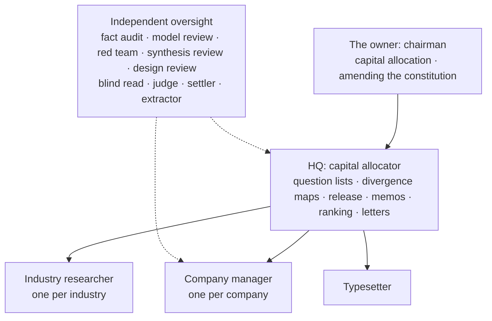

# agents/: role definitions

This directory defines the thirteen roles of Owner's Office. Each role has two files: `<role>.yml` is the machine-readable definition (it follows thesis-ci's `spec/schemas/agent.schema.json`: model, reporting line, what the role can and cannot see, outputs, decision rights, prompt ids, whether it is managed by trust level), and `<role>.md` is its charter. If the two conflict, the YAML prevails and the charter is corrected.

The system has no "Buffett agent": the masters' principles are a way of organizing, not personas (see [masters.md](../constitution/masters.md)). Every role acts within the [investment constitution](../constitution/owner.md) and takes its authority from [decision-rights.yml](../constitution/decision-rights.yml). This directory only defines roles; nothing in it is investment advice.

## Prompts are cited by id only

The prompts that drive these roles, prompt set v3 — the 00 series rules, the 00D design system, and 01–19 — are in the `prompts/` directory of the private repository `owners-office-private`. The public repository cites them by id only (`03`, `04A`, `15B`, ...) and does not hold their full text. This is the owner's decision of 2026-09-24; whether to publish them later is a separate decision ([decisions/0009](../docs/decisions/0009-prompt-set-v3.md)). The letters in an id mark different parts of the same prompt, for example 04A fact audit, 04B red team, 04B-lite the inversion list for a quarterly update, 04C model review; all parts of 01 and of 03 belong to the company manager and are registered as whole prompts.

## Organization

## The thirteen roles

| Role | Definition | Reports to | Model | Prompts | Trust level |
| --- | --- | --- | --- | --- | --- |
| Company manager `company_manager` | [yml](company_manager.yml) · [charter](company_manager.md) | HQ | `claude-opus-5-5` | 01 02 03 05 06 07 08 10 11 13 15A | levels 0–3, starting at 1 |
| Industry researcher `industry_researcher` | [yml](industry_researcher.yml) · [charter](industry_researcher.md) | HQ | `claude-opus-5-5` | none yet (phase 4) | levels 0–3, starting at 1 |
| HQ: capital allocator `hq_capital_allocator` | [yml](hq_capital_allocator.yml) · [charter](hq_capital_allocator.md) | the owner | `claude-opus-5-5` | 14Q 14B 17A 17B 17C 17D 18 | not applicable |
| Extractor `extractor` | [yml](extractor.yml) · [charter](extractor.md) | nobody (it serves the isolation of the audit) | `claude-opus-5-5` | 16A 16B | not applicable |
| Typesetter `typesetter` | [yml](typesetter.yml) · [charter](typesetter.md) | HQ | `claude-opus-5-5` | 19 | not applicable |
| Fact audit `auditor` | [yml](auditor.yml) · [charter](auditor.md) | nobody (independent oversight) | `claude-opus-5-5` | 04A 09A 12A | not applicable |
| Model review `model_reviewer` | [yml](model_reviewer.yml) · [charter](model_reviewer.md) | nobody (independent oversight) | `claude-opus-5-5` | 04C | not applicable |
| Red team `red_team` | [yml](red_team.yml) · [charter](red_team.md) | nobody (independent oversight) | `claude-opus-5-5` | 04B 04B-lite 09B | not applicable |
| Synthesis review `synthesis_reviewer` | [yml](synthesis_reviewer.yml) · [charter](synthesis_reviewer.md) | nobody (independent oversight) | `claude-opus-5-5` | 12B | not applicable |
| Design review `design_reviewer` | [yml](design_reviewer.yml) · [charter](design_reviewer.md) | nobody (independent oversight) | `claude-opus-5-5` | 09C 12C | not applicable |
| Blind read `blind_reader` | [yml](blind_reader.yml) · [charter](blind_reader.md) | nobody (independent oversight) | `claude-opus-5-5` | 14A | not applicable |
| Judge `judge` | [yml](judge.yml) · [charter](judge.md) | nobody (independent oversight) | `claude-opus-5-5` | 14T | not applicable |
| Settler `settler` | [yml](settler.yml) · [charter](settler.md) | nobody (independent oversight) | `claude-opus-5-5` | 15B | not applicable |

Steps that belong to no role: fetching, XBRL parsing and quantitative tests are run by deterministic code in `pipeline/`, without calling a model; the consistency of the complete company report's valuation and ranking (12V) is also compared item by item by the pipeline. They are all decision level L1.

## Visibility

`can_see` and `cannot_see` use exactly the input names from the prompts' front matter (`dossier`, `thesis`, `update`, `fact_table`, `question_list_stripped`, ...), with no separate vocabulary; optional inputs drop the trailing `?`.

- `can_see` is an allow-list: every input of every prompt part the role runs is in it, and the pipeline trims the inputs of each call by it (00 §G6).
- `cannot_see` is material that is explicitly withheld, and it does not intersect the inputs of any of the role's parts. A few words that are not input names (`conclusions`, `reasoning`) keep the terms of the isolation table, for the C-AGENT-ISOLATION check.
- The red team is called in two passes: the first pass cannot see the product's own counter-arguments, and only the second gets them. This ordering is guaranteed by the prompts' pass-by-pass inputs (`inputs_pass1` / `inputs_pass2`), which a flat list cannot express, so `product_counter_section` and `document_counter_section` are listed only in its `can_see`; `cannot_see` lists the full product, the dossier and `thesis.yml`, which no pass receives.
- C-PROMPT-ISOLATION checks part by part: if an input of any part (pass-by-pass inputs included) appears in the role's `cannot_see`, it warns. The prompts are in the private repository, so this check runs in the private repository with `--counterpart` (in the private repository's CI, locally, and in the acceptance script). The other half, that every input is within `can_see`, is self-checked when this directory is maintained.
- Steps that need isolation (04A, 04B, 09A, 09B, 12A, 12B, 14A, 14T, 15B, 16) run only through `pipeline/llm.py`: its calls have no memory, on either backend (00 §G6). A manual trial run on claude.ai must turn off memory, project knowledge and custom instructions, use a new conversation for each part, and treat the output only as a lead (H5).

| Role | Can see | Cannot see |
| --- | --- | --- |
| Company manager | The archive, the constitution, new filings, test and settlement results, audit conclusions | The blind read's answers |
| Fact audit | The list of atomic facts and the primary sources | The product itself, and its reasoning and conclusions |
| Model review | Private valuations, series readings | — (everything else is limited by the allow-list) |
| Red team | The product and thesis with the counter-arguments removed | In the first pass, the product's own counter-arguments and dossier parts 9 and 12; the fact audit's conclusions, the blind read's answers |
| Synthesis review | The complete report, the list of connections, the four research documents | — |
| Design review | The product and its page images | — |
| Blind read | New filings, the neutral question list with the mapping removed | The archive, the thesis, drafts, any conclusion |
| Judge | The questions and criteria of the qualitative tests, the specified documents | The archive, the thesis, drafts |
| Settler | The statements and criteria of the items, filings, metric readings | Probabilities, authors, the owner's overrides |
| Extractor | The product or filings, metric definitions | The thesis and drafts (except the product itself in 16A) |
| Typesetter | Final content and layout intent | — |
| HQ | Everything | — |
| Industry researcher | Industry modules and industry materials | The holdings list, company archives, private valuations and the ranking |

## Models, budget and records

- Every role runs on `claude-opus-5-5` at effort `high`, the owner's choice of 2026-09-27 ([decisions/0025](../docs/decisions/0025-one-model-opus-5-5.md)); on a refusal, API calls fall back under the server's default rules (`fallbacks: default`). The design document's split (a mid-tier model for drafting, the strongest model for oversight, [decisions/0003](../docs/decisions/0003-model-assignment-and-budget.md)) no longer applies: the oversight roles stay independent through what they may see and through separate calls, not through a different model.
- Model selection is HQ's decision level L2, reported in the monthly letter. For the budget, see `budget` in `decision-rights.yml`: near the cap, candidate companies are paused first and the drafting roles' effort is lowered from `high` to `medium` next; oversight roles are not downgraded.
- Prompts do not specify models (H5). `pipeline/llm.py` uses this directory as its only role table: it takes the model from `agents/<role>.yml`, checks against `prompts` which prompts and parts a role may run, and uses `can_see` / `cannot_see` to refuse inputs that must not be given before any request is sent; it records the model that actually answered, the versions of 00 and of the prompt, and the input hash. All thirteen roles can be called, with two exceptions: the industry researcher has no prompt yet, and the typesetter's 19 has to deliver a PDF and page images, which needs an environment that can execute code (see [decisions/0015](../docs/decisions/0015-llm-entry-point-v3.md)).

## Choices made here

A few points that the design document and the prompts leave open were settled here and recorded in [decisions/0009](../docs/decisions/0009-prompt-set-v3.md): a recalculated valuation taking effect is filed under the model review; settlement is filed under `test`, extraction under `parse` and typesetting under `draft`; the extractor reports to nobody and the typesetter reports to HQ; HQ's `can_see` lists the actual inputs of its parts; the industry researcher borrows the closest input names until its prompt is written.
