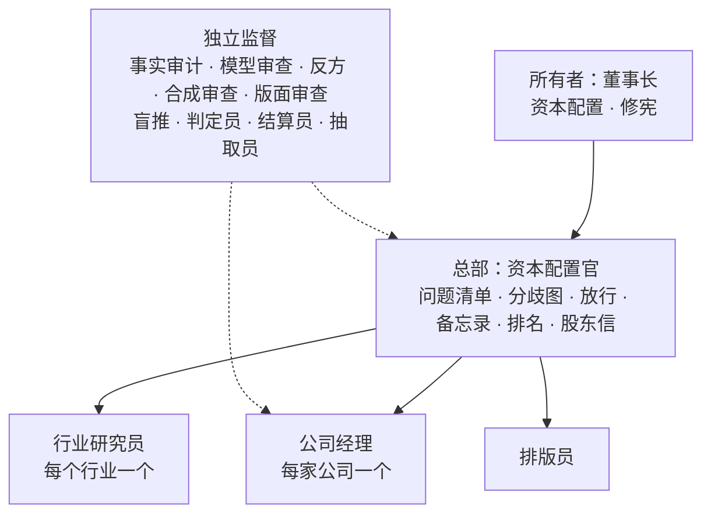

# agents/：角色定义

[中文](#中文) · [English](#english)

## 中文

这里定义 Owner's Office 的十三个角色。每个角色两份文件：`<role>.yml` 是机器可读的定义（符合 thesis-ci 的 `spec/schemas/agent.schema.json`：模型、汇报关系、能看到和看不到什么、产出、决策权、提示词编号、是否受信任等级管理），`<role>.md` 是职责说明。两者冲突时以 YAML 为准，并修正说明。

系统里没有“巴菲特 agent”：大佬的原则是组织方式，不是人设（见 [masters.md](../constitution/masters.md)）。所有角色都在[投资宪法](../constitution/owner.md)之内行事，权限来自 [decision-rights.yml](../constitution/decision-rights.yml)。本目录只定义角色，不构成投资建议。

### 提示词只按编号引用

驱动这些角色的提示词 v3——00 系列规则、00D 设计系统、01–19——放在私有仓库 `owners-office-private` 的 `prompts/` 目录。公开仓库只按编号引用它们（`03`、`04A`、`15B`……），不放全文：这是所有者 2026-09-24 的决定，以后是否公开另行决定（[decisions/0009](../docs/decisions/0009-prompt-set-v3.md)）。编号里的字母是同一份提示词的不同部分，例如 04A 事实审计、04B 反方、04B-lite 季度更新的反向清单、04C 模型审查；01 和 03 的各部分都归公司经理，按整份登记。

### 组织结构

### 十三个角色

| 角色 | 定义 | 向谁汇报 | 模型 | 提示词 | 信任等级 |
| --- | --- | --- | --- | --- | --- |
| 公司经理 `company_manager` | [yml](company_manager.yml) · [说明](company_manager.md) | 总部 | `claude-sonnet-5` | 01 02 03 05 06 07 08 10 11 13 15A | 0–3 级，从 1 级起步 |
| 行业研究员 `industry_researcher` | [yml](industry_researcher.yml) · [说明](industry_researcher.md) | 总部 | `claude-sonnet-5` | 尚无（第 4 阶段） | 0–3 级，从 1 级起步 |
| 总部：资本配置官 `hq_capital_allocator` | [yml](hq_capital_allocator.yml) · [说明](hq_capital_allocator.md) | 所有者 | `claude-sonnet-5` | 14Q 14B 17A 17B 17C 17D 18 | 不适用 |
| 抽取员 `extractor` | [yml](extractor.yml) · [说明](extractor.md) | 无（为审计的隔离服务） | `claude-sonnet-5` | 16A 16B | 不适用 |
| 排版员 `typesetter` | [yml](typesetter.yml) · [说明](typesetter.md) | 总部 | `claude-sonnet-5` | 19 | 不适用 |
| 事实审计 `auditor` | [yml](auditor.yml) · [说明](auditor.md) | 无（独立监督） | `claude-fable-5-1` | 04A 09A 12A | 不适用 |
| 模型审查 `model_reviewer` | [yml](model_reviewer.yml) · [说明](model_reviewer.md) | 无（独立监督） | `claude-fable-5-1` | 04C | 不适用 |
| 反方 `red_team` | [yml](red_team.yml) · [说明](red_team.md) | 无（独立监督） | `claude-fable-5-1` | 04B 04B-lite 09B | 不适用 |
| 合成审查 `synthesis_reviewer` | [yml](synthesis_reviewer.yml) · [说明](synthesis_reviewer.md) | 无（独立监督） | `claude-fable-5-1` | 12B | 不适用 |
| 版面审查 `design_reviewer` | [yml](design_reviewer.yml) · [说明](design_reviewer.md) | 无（独立监督） | `claude-fable-5-1` | 09C 12C | 不适用 |
| 盲推 `blind_reader` | [yml](blind_reader.yml) · [说明](blind_reader.md) | 无（独立监督） | `claude-fable-5-1` | 14A | 不适用 |
| 判定员 `judge` | [yml](judge.yml) · [说明](judge.md) | 无（独立监督） | `claude-fable-5-1` | 14T | 不适用 |
| 结算员 `settler` | [yml](settler.yml) · [说明](settler.md) | 无（独立监督） | `claude-fable-5-1` | 15B | 不适用 |

不归任何角色的步骤：抓取、XBRL 解析和定量测试由 `pipeline/` 里的确定性代码执行，不调用模型；完整企业报告的估值与排名一致性（12V）也由流水线逐项比对。它们同属决策 L1。

### 可见范围

`can_see` 与 `cannot_see` 用的就是提示词 front matter 里的输入名（`dossier`、`thesis`、`update`、`fact_table`、`question_list_stripped`……），不另造词汇；可选输入去掉末尾的 `?`。

- `can_see` 是白名单：一个角色所有提示词部分的输入都在其中，流水线按它裁剪每次调用的输入（00 §G6）。
- `cannot_see` 是明令不给的材料，与它任何一部分的输入都不相交。少数不是输入名的词（`conclusions`、`reasoning`）沿用隔离表的说法，供 C-AGENT-ISOLATION 检查。
- 反方分两遍调用：第一遍看不到成品自己的反方内容，第二遍才给。这层先后由提示词的分遍输入（`inputs_pass1`／`inputs_pass2`）保证，一张平铺的清单表达不了，所以 `product_counter_section`、`document_counter_section` 只列在它的 `can_see` 里；`cannot_see` 列的是任何一遍都不给的完整成品、档案与 `thesis.yml`。
- C-PROMPT-ISOLATION 逐部分核对：任何一部分（含分遍的输入）的输入出现在该角色的 `cannot_see` 里就报警。提示词在私有仓库，所以这项检查在私有仓库带 `--counterpart` 运行（私有仓库的 CI、本地和验收脚本）。“输入都在 `can_see` 之内”这一半由本目录维护时自查。
- 需要隔离的步骤（04A、04B、09A、09B、12A、12B、14A、14T、15B、16）只经 `pipeline/llm.py` 运行：API 调用没有记忆。在 claude.ai 手动试跑必须关闭记忆、项目知识和自定义指令，每一部分各开一段新对话，产出只作线索（H5）。

| 角色 | 能看到 | 看不到 |
| --- | --- | --- |
| 公司经理 | 档案、宪法、新文件、测试与结算结果、审计结论 | 盲推的回答 |
| 事实审计 | 原子事实清单与一手原文 | 成品本身，及其推理与结论 |
| 模型审查 | 私有估值、系列读数 | —（其余由白名单限定） |
| 反方 | 删去反方内容的成品与论点 | 第一遍看不到成品自己的反方内容和档案第 9、12 部分；事实审计的结论、盲推的回答 |
| 合成审查 | 完整报告、连接清单、四份研究材料 | — |
| 版面审查 | 成品与页面图像 | — |
| 盲推 | 新文件、去掉对应关系的中性问题清单 | 档案、论点、草稿、任何结论 |
| 判定员 | 定性测试的问题与标准、指定文件 | 档案、论点、草稿 |
| 结算员 | 条目的陈述与标准、文件、指标读数 | 概率、作者、所有者的改写 |
| 抽取员 | 成品或文件、指标定义 | 论点与草稿（16A 的成品本身除外） |
| 排版员 | 定稿内容与版面意图 | — |
| 总部 | 全部 | — |
| 行业研究员 | 行业模块与行业资料 | 持仓名单、公司档案、私有估值与排名 |

### 模型、预算与记录

- 起草类角色（公司经理、行业研究员、总部、抽取员、排版员）用 `claude-sonnet-5`；监督类角色（事实审计、模型审查、反方、合成审查、版面审查、盲推、判定员、结算员）用 `claude-fable-5-1`，遇到拒答时按服务端默认规则回退（`fallbacks: default`）；effort 一律 `high`。依据是设计文档“起草用中档模型，审计和盲推用最强模型”和 [decisions/0003](../docs/decisions/0003-model-assignment-and-budget.md)。
- 模型选用是总部的决策 L2，在月度股东信里报备。预算见 `decision-rights.yml` 的 `budget`：接近上限时先停候选公司，再降级起草模型；监督类角色不降级。
- 提示词不指定模型（H5）。`pipeline/llm.py` 只以本目录为角色表：按 `agents/<role>.yml` 取模型，按 `prompts` 核对角色能跑哪些提示词和部分，按 `can_see`／`cannot_see` 在发请求之前拒绝不该给的输入；记录实际应答的模型、00 与提示词的版本和输入哈希。十三个角色都能调用，两处例外：行业研究员还没有提示词；排版员的 19 要交出 PDF 与页面图像，需要能执行代码的环境（见 [decisions/0015](../docs/decisions/0015-llm-entry-point-v3.md)）。

### 这里做的取舍

设计文档和提示词没写明、在这里定下的几处，记在 [decisions/0009](../docs/decisions/0009-prompt-set-v3.md)：估值重算生效记在模型审查名下；结算记在 `test` 名下、抽取记在 `parse` 名下、排版记在 `draft` 名下；抽取员不向任何人汇报，排版员向总部汇报；总部的 `can_see` 列出它各部分的实际输入；行业研究员在提示词写成之前借用最接近的输入名。

## English

This directory defines the thirteen roles of Owner's Office. Each role has a machine-readable `<role>.yml` (validated against thesis-ci's `agent.schema.json`: model, reporting line, what it can and cannot see, outputs, decision rights, prompt ids, whether it is trust-managed) and a Chinese charter `<role>.md`. If they disagree, the YAML wins. There is no "Buffett agent": the investors' principles shape how the office is organized; they are not personas. Every role acts inside the [owner's constitution](../constitution/owner.md) and takes its authority from [decision-rights.yml](../constitution/decision-rights.yml). Nothing here is investment advice.

- **Prompts are private and referenced by id only.** Prompt set v3 (00 series rules, 00D design system, 01–19) lives in the private repository `owners-office-private` under `prompts/`. This public repository refers to prompts and their parts by id (`03`, `04A`, `15B`, ...) and never copies their text. That is the owner's decision of 2026-09-24; whether to publish them later is a separate decision ([decisions/0009](../docs/decisions/0009-prompt-set-v3.md)).
- **Roles.** Drafting roles (`company_manager`, `industry_researcher`, `hq_capital_allocator`, `extractor`, `typesetter`) use `claude-sonnet-5`. Oversight roles (`auditor`, `model_reviewer`, `red_team`, `synthesis_reviewer`, `design_reviewer`, `blind_reader`, `judge`, `settler`) use `claude-fable-5-1` with server-side refusal fallback. Oversight roles, and the extractor that serves the fact audit, have `reports_to: null`; the company manager and the industry researcher are trust-managed (levels 0–3, starting at 1).
- **Visibility.** `can_see` and `cannot_see` use exactly the input names from the prompts' front matter. `can_see` is an allow-list that covers every input of every part the role runs; `cannot_see` never intersects those inputs, second-pass inputs included. The red team gets the product's own counter-argument only on its second pass; that ordering is carried by the prompts' `inputs_pass1` / `inputs_pass2`, so the counter sections are listed in `can_see` only. `C-PROMPT-ISOLATION` runs in the private repository with `--counterpart`, where both the prompts and this directory are visible.
- **Deterministic steps** (fetching, XBRL parsing, quantitative tests, the report's valuation-consistency check 12V) are pipeline code, not roles.
- All model calls go through `pipeline/llm.py`, which uses this directory as its only role table: the model comes from `<role>.yml`, `prompts` says which prompts and parts a role may run, and inputs outside `can_see` or inside `cannot_see` are refused before any request is sent. It records the model that actually answered, the versions of 00 and of the prompt, and the input hash. All thirteen roles can be called, with two exceptions: the industry researcher has no prompt yet, and the typesetter's prompt 19 delivers a PDF and page images, which needs a code-execution environment ([decisions/0015](../docs/decisions/0015-llm-entry-point-v3.md)).
