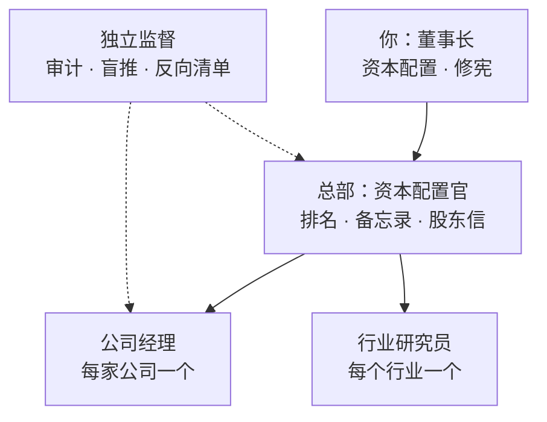
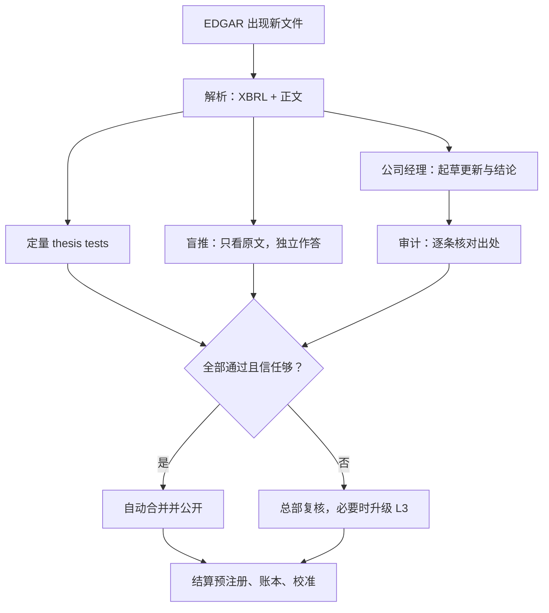

# Owner's Office：项目框架与工作思路

Sep 24, 2026 · @Ken

## 定位与差异化

Owner's Office 不和现有项目比“谁更会研究企业”，而是补上它们都没做的一件事：持续测量你作为所有者的判断是否可靠。别人只追踪企业，它同时追踪你。

| 方向 | 代表项目 | 回答的问题 | 和本项目的关系 |
| --- | --- | --- | --- |
| 交易型多智能体 | [ai-hedge-fund](https://github.com/virattt/ai-hedge-fund/tree/main)、[TradingAgents](https://github.com/tauricresearch/tradingagents) | 现在该买还是卖？ | 不做：无交易信号、无回测 |
| 研报生成 | [FinRobot](https://github.com/ai4finance-foundation/finrobot) | 这家公司值多少？ | 你的 02 报告已覆盖，不作卖点 |
| 数据与研究平台 | [OpenBB](https://github.com/orgs/OpenBB-finance/repositories) | 数据在哪、怎么看？ | 仅作数据来源候选 |
| 论点监控 | [Helm、MyThesis](https://helmterminal.dev/blog/thesis-tracking-apps)、[ThesisLoop](https://thesisloop.ai/)、[Mira](https://github.com/topics/decision-log) | 企业还符合我的论点吗？ | 最近的邻居；监控本身不算创新 |
| 大师方法论 + 多 agent | [ai-berkshire](https://github.com/topics/investment-research) | 大师会怎么看？ | 最需要避开的雷同方向 |
| 预测校准 | [Fatebook](https://forum.effectivealtruism.org/posts/DWFRBzK3rAH3HFDZr/fatebook-the-fastest-way-to-make-and-track-predictions) | 我的概率判断准吗？ | 借鉴计分方法，但它不懂财报 |

这些项目都在评价企业或交易，没有一类在系统地评价投资者本人。论点监控类工具甚至天然带锚：它们透过你的论点读新证据，AI 和你被同一个结论牵着走。

本项目押注五件事，后文逐一展开：

1. **伯克希尔式分权。** 系统按你的投资宪法自治运行，你只做资本配置和修宪；每个 agent 的权限靠历史准确率挣来。
2. **双向问责。** 管理层对股东的承诺、系统和你的预测，用同一种账本、同一套规则结算。
3. **可验证的预注册。** 财报前的预期必须在业绩首次公开之前合并，并带上任何人都能核对的时间戳。
4. **反锚定。** 一个看不到论点的“盲推”模型独立下结论；它和起草模型的分歧，是复核最该花时间的地方。
5. **能力圈实测。** 按领域统计的校准分，把芒格说的“能力圈”从自我声明变成数据。

诚实地说，单个零件都有先例。Brier 计分是超预测研究的标准工具，也已有人主张投资者给子预测记分（[来源](https://evakeiffenheim.substack.com/p/how-to-engineer-skill-in-investing)）；ThesisLoop 已在宣传管理层承诺兑现评分。新意在于把这些零件接进同一份档案和同一条财报时间线。大佬的哲学在这里是组织原则，不是荐股人设：系统里没有“巴菲特 agent”，只有一间按伯克希尔方式运转的办公室。对外介绍也据此区分，不用“大师方法论”或“多 agent 对抗”当卖点，这两个说法已被占据。

## 设计原则

七条原则。和上一版相比，核心变化是分权：系统在你的投资宪法之内自治运行，你只做两件事，资本配置和修宪。

1. **所有者视角。** 跟踪对象是企业论点，不是交易。系统不产生买卖信号，不做回测，不预测股价。
2. **分权自治，例外上报。** 日常决策由各 agent 依据投资宪法自行做出并执行；只有涉及资金或修改宪法的事项才上报给你。
3. **默认不动。** 凡涉及资金的事项，默认选项永远是维持现状；你不回复，就按默认处理。系统不会、也无法替你交易。
4. **价格静默。** 不显示日常股价。价格只作为事件出现：进入或离开事先写好的合理区间、便宜区间时，提醒一次。
5. **先写下，后验证。** 预期、概率和判定标准在结果出来之前登记；事后按事先的标准结算，评价决策过程而不是结果。
6. **每个数字可追溯。** 档案中的事实都带出处（哪份文件、哪一节、哪天）；没有出处的数字不能合并。
7. **独立，且信任靠挣。** 起草、审计、盲推看不到彼此的结论；每个 agent 的自治权限随它的历史准确率扩大或收缩。

## 核心架构：论点即代码

每家公司的论点按软件项目来维护：档案是源代码，thesis breakers 是测试，新财报触发测试，合并一个 PR 就是一次有记录的决策。

| 软件工程 | 在 Owner's Office 里 | 解决什么 |
| --- | --- | --- |
| 源代码 | 公司档案：12 维框架，Markdown + YAML | 理解只有一个权威版本 |
| diff | 每次更新一个提交，逐行显示论点变化 | 看得见认知如何演变 |
| 单元测试 | thesis tests，由 thesis breakers 改写而成 | “什么会证明我错”变成可执行的检查 |
| CI | 新的 10-Q、10-K、8-K 自动触发全部测试 | 检查不依赖记忆和心情 |
| Code review | 独立审计 + 你亲笔写的结论 | 防止自我确认 |
| 依赖 | 公司档案引用行业研究模块 | 行业变化自动波及相关公司 |
| Release | 年度“致自己的股东信” + 错误清单 | 固定节奏的复盘 |

**三类 thesis tests。** 每条测试都在结果出来之前写好门槛，结果分为通过、警告、失败、无法判定四种。

1. **定量测试：** 直接用 XBRL 财务数据计算。例：稀释后股本连续两年上升即失败，用来检验回购纪律。
2. **定性测试：** 由独立模型对照财报原文判定，必须附出处和一句以内的原文摘录。例：管理层是否下调了中期财务目标。
3. **时效测试：** 档案里每条事实都带截至日期，过期未复核就报警。例：护城河一节超过四个季度没有复核。

**测试失败不等于卖出。** 失败后，负责这家公司的 agent 必须在 7 天内按宪法写出结论：维持、修改论点，还是建议减仓，并附理由。只有结论触及宪法里的卖出条件，才升级为给你的备忘录：护城河永久受损、商业模式根本改变、管理层变质、资本配置严重失误，或出现明显更好的机会。备忘录的默认选项仍是维持现状。

**PR 即决策记录。** 每个更新 PR 的正文结构固定：AI 摘要、证据与出处、测试结果、审计意见、盲推分歧，以及公司 agent 引用宪法条款写出的“这改变论点吗？”。检查全部通过、且该 agent 的信任等级足够时自动合并；否则按分权规则升级。合并时间由 GitHub 服务器记录，预注册另加 OpenTimestamps 时间戳。

**可复现。** 每份 AI 产出都记下模型名、提示词版本（git 哈希）和输入文件哈希。结论变了，你能分清是世界变了，还是提示词变了。

## 分权治理：伯克希尔式的决策权

整个系统照伯克希尔的方式组织：总部极小，各公司自治，董事长只管资本配置和选人。你是董事长，Claude Code 和各个 agent 是经理人。巴菲特在股东手册里写道，伯克希尔授权到近乎放手：约 37.7 万名员工里只有 26 人在总部，他和芒格主要负责资本配置和照顾关键经理人（[股东手册](https://www.berkshirehathaway.com/ownman.pdf)）。

**三级决策权：**

| 级别 | 谁决定 | 事项 | 你看到什么 |
| --- | --- | --- | --- |
| L1 自治 | agent 自行决定并执行 | 抓取、解析、起草、测试、审计、例行更新合并、档案事实修订、行业路标检查 | 不打扰，月度股东信里汇总 |
| L2 自治并报备 | agent 决定并执行，事后报备 | 预注册内容、情景概率调整、测试警告的处置、候选名单轮换、模型选用、公开发布（须审计无误） | 月度股东信里各占一行 |
| L3 董事长 | 你决定；系统给一页备忘录和默认选项 | 买入、加仓、减仓、卖出；修改投资宪法 | 一页备忘录；14 天不回复即按默认处理，也就是维持现状 |

**组织结构：**



公司经理相当于伯克希尔的子公司 CEO：负责自家公司的档案、预注册、测试和账本，把结论交给总部。总部只做跨公司比较和资本配置建议；独立监督不向任何经理人汇报。

**宪法要点**（系统据以自治的规则，由 Claude Code 展开成 `constitution/owner.md`）：

1. 企业质量第一，管理层第二，估值第三；宁可用合理价格买优秀企业，也不用低价买普通企业。
2. 质量的试金石：股市关闭十年，是否仍愿意持有？看护城河、定价权、资本回报和不断增长的自由现金流。
3. 管理层看资本配置是否理性、是否像所有者一样思考，回购、分红和再投资是否得当。
4. 集中持有 4–5 家；10–20% 是入选门槛而不是目标；仓位来自理解深度、质量、确定性和安全边际，不来自波动率模型。
5. DCF 只是近似和辅助；折现率等于长期无风险利率加企业特定风险溢价，质量越高溢价越低，6–10% 只是当前利率下的参考。
6. 只因永久性恶化或明显更好的机会卖出；不因价格下跌、衰退、恐慌或单季不及预期卖出。
7. 每个持仓的长期预期必须胜过 VOO 或伯克希尔；现金是期权，不为凑仓位或消化闲置现金而买。
8. 少交易，一次下单建仓，不追求完美买点。

**大佬原则怎样变成系统规则：**

| 来源 | 原则 | 在系统里变成 |
| --- | --- | --- |
| [巴菲特](https://www.berkshirehathaway.com/ownman.pdf) | 授权到近乎放手；总部只管资本配置和选人 | 三级决策权，你只处理 L3；“选人”对应总部按错误率和成本为每个角色选模型 |
| [巴菲特](https://rationalwalk.com/highlights-from-warren-buffetts-letter-to-shareholders/) | 宁可承担少数坏决定的可见代价，也不要官僚拖延的隐形代价 | 例行事项不设人工审批，错误靠事后审计和降级纠正 |
| [巴菲特](https://www.berkshirehathaway.com/ownman.pdf) | 坦诚：告诉股东他们处境互换时想知道的事实 | 月度股东信先写坏消息和“本月最大的不确定” |
| [芒格](https://jamesclear.com/great-speeches/2007-usc-law-school-commencement-address-by-charlie-munger) | 最高的形态是“应得信任”织成的无缝网络：程序很少，信任要配得上 | agent 权限随历史准确率升降，出一次事实错误就降级 |
| 芒格 | 反过来想；守住能力圈 | 每次更新附“怎样会永久亏损”的反向清单；校准差的领域不进 10–20% 候选 |
| [林奇](https://invest-like.com/investors/peter-lynch/) | 公司分六类；两分钟讲清持有理由 | 按类别自动套用监控模板，类别变化即换模板；每家维护一段两分钟故事，你只读这一段 |
| [德鲁肯米勒](https://actionablenews.substack.com/p/aia-october-2024) | 看 18–24 个月后的世界，而不是现在 | 预注册以 18 个月为主视野，辅以本季可检验的短期项 |
| [卡尼曼](https://behavioralscientist.org/a-conversation-with-daniel-kahneman-about-noise/) | 先分项、独立、基于事实地判断，推迟整体直觉 | 审计与盲推互不可见；总部先看分项评分，再下整体结论 |

**挣来的信任：**

- 每个公司经理有 0–3 级信任等级，由最近 8 次更新的审计错误数和分歧的事后裁定决定。
- 3 级：通过全部检查的更新自动合并并公开。2 级：自动合并，公开前由总部复核。1 级：更新先留在私有仓库，由总部逐条复核。0 级：暂停自治，写进股东信的“待你一看”栏。
- 出现一次事实错误降一级，连续 4 次零错误升一级；新 agent 从 1 级起步。

**你还要做的事：** 每月读一封股东信，约 10 分钟；每年读一封年度信，决定是否修宪；L3 备忘录目标每月不超过 2 份。其余全部交给系统。

**这样做的代价：** 巴菲特自己承认，放手意味着有时发现经理人的问题会晚一步（[2009 年股东信](https://rationalwalk.com/highlights-from-warren-buffetts-letter-to-shareholders/)）。本系统用三样东西弥补：硬性的 tripwire、独立审计，以及会自动降级的信任。

## 四个创新模块

四个模块共用一条主线：你用什么标准要求企业，就用同样的标准要求自己，而且标准必须在结果出来之前写下。

### A. 财报前预注册

每个持仓在业绩发布前登记 3–5 条可结算的预期，事后按事先写好的标准结算。做法借鉴临床试验和科学界的注册报告：先登记假设，再看数据，杜绝事后编假设。

- **谁来写：** 公司经理 agent 起草全部预期，以 18 个月为主视野，辅以本季可检验的短期项。你可以在发布前改一个概率或加一条，也可以什么都不做；你改过的每一处单独记账，称为“覆盖”。
- **每条预期包含：** 陈述、概率、判定标准、数据来源。格式示例：“本季营收同比增速不低于上季，概率 60%，以 10-Q 利润表为准。”
- **时间规则：** 必须在业绩首次公开之前合并。系统用 EDGAR 上业绩公告的 `acceptanceDateTime` 核对（8-K 的 Item 2.02；PDD 这类外国发行人为 6-K）；新闻稿可能早于备案，所以截止时间定在发布日前一天结束。合并时加 OpenTimestamps 时间戳，任何人都能独立核对没有倒填。
- **结算：** 财报入库后，AI 按判定标准结算并附出处；有歧义的由总部裁定，仍有争议的记为“无法判定”，不计分。

### B. 双向言行账本

同一种账本记两本账：管理层对股东说过的话，和你对自己说过的话。

- **管理层一侧：** 从股东信、10-K 的 MD&A、业绩新闻稿和投资者日材料中，抽取可检验的承诺：数字目标、资本开支计划、回购授权、产品时间表。每条记下出处和到期日。
- **四档结算：** 兑现、部分兑现、未兑现、悄然消失。“悄然消失”指之后的沟通再也不提，这往往比公开承认未兑现更说明问题。
- **坦诚度：** 未兑现的承诺，下一封股东信有没有主动承认？这是巴菲特评价管理层的老办法，现在可以逐年计数。
- **资本配置记分卡：** 每次回购的均价，对比回购当时你档案里的内在价值区间，看回购是在创造价值还是在高位消耗现金。从建档之日起累积。
- **系统与你这一侧：** 预注册的预期、08 情景文档里的三年判断、决策日志里的“预期结果”，全部进同一本账，按同样四档结算。

只给管理层打分，ThesisLoop 这类产品已经在做；这里的新意在于对称。

### C. 校准与能力圈实测

所有已结算的预期按领域汇总成校准分，让能力圈的边界由记录画出来，而不是由感觉画出来。

```latex
BS = \frac{1}{N}\sum_{i=1}^{N}(p_i - o_i)^2
```

其中 p 是你给出的概率，o 是结果（发生记 1，未发生记 0）。0 分为完美；每条都报 50% 得 0.25 分。

- **按领域分组：** 企业软件、支付与金融数据、消费品、半导体、电商等，每组给出 Brier 分和校准曲线，也就是“说 70% 的事，实际发生了几成”。
- **两本账：** 一本记系统自己的预测，一本只记你的覆盖。你的覆盖如果在某个领域长期比系统准，说明你在那里有真正的增量；反之，那里就该少插手。能力圈由此实测，而且几乎不花你的时间。
- **怎么用：** 作为仓位判断的一项证据，而不是公式。校准差的领域不进 10–20% 仓位的候选，这正是你“仓位来自理解深度”的原则。
- **诚实的限制：** 样本要够。以 4 个持仓、每家每季 4 条计，到 2027 年底约 80 条系统预测，分到各领域后仍然偏少，你的覆盖会更少。在那之前只看趋势，不下结论。

### D. 行业—公司依赖图

Business Library 的行业研究变成可被引用的模块；公司档案声明自己依赖哪些行业，行业一变，相关公司自动进入复核。

- **示例：** AXP 依赖“支付与卡组织”，PEP、KO 依赖“非酒精即饮饮料”，INTC、NVDA 依赖“半导体代工”，正好是你已完成的三个行业。
- **路标机制：** 行业模块里写下可观测的路标，比如某种账户到账户实时支付或稳定币的使用量越过事先定的门槛。路标触发时，CI 为所有依赖它的公司开复核 issue，并重跑相关 thesis tests。
- **保留你的规则：** 行业模块本身不谈持仓、不给建议；依赖关系只写在公司一侧。
- **范围：** 第一版只做行业到公司；公司之间的客户、供应商、竞争关系放到后续阶段。路标写不清楚的行业判断，无法自动监控。

## 仓库结构与开源策略

三个仓库各司其职：thesis-ci 是任何人都能安装的开源工具，owners-office 是你用它维护的公开记录，私有仓库放完整档案和金额。从第一天起公开开发，更新本身就是项目在 GitHub 上的持续记录。

| 仓库 | 可见性 | 内容 | 许可 |
| --- | --- | --- | --- |
| thesis-ci | 公开 | YAML 格式规范；EDGAR 监听与结算的 GitHub Action；预注册核验（含 OpenTimestamps）；Brier 与校准工具 | 代码 MIT，规范 CC BY 4.0 |
| owners-office | 公开 | 投资宪法与大佬原则、决策权配置、agent 定义、各公司 thesis.yml、预注册、预测与覆盖、言行账本、股东信；MSFT 完整示范档案 | 方法文档 CC BY 4.0，研究内容保留权利 |
| owners-office-private | 私有 | 其余公司的完整档案、PDF 报告、带金额的决策日志、估值配置器的情景内容 | 不公开 |

```text
owners-office/
├── CLAUDE.md                  # 常驻规则，200 行以内
├── docs/
│   ├── DESIGN.md              # 本文档
│   ├── STATUS.md              # 进度，新会话读它接着做
│   └── decisions/             # 自主决定的记录
├── constitution/
│   ├── owner.md               # 你的投资宪法
│   ├── masters.md             # 大佬原则 → 系统规则
│   └── decision-rights.yml    # 三级决策权与信任等级
├── agents/                    # 各角色的提示词、权限、所用模型
├── industries/                # 行业模块与路标
├── companies/
│   └── MSFT/                  # 每家一个目录；MSFT 另含完整档案
│       ├── thesis.yml
│       ├── story.md           # 两分钟持有理由
│       ├── prereg/
│       ├── ledger.yml
│       └── updates/
├── forecasts/                 # 系统预测 + 你的覆盖记录
├── letters/                   # 月度与年度股东信
└── .github/workflows/         # 定时任务、自动合并、升级
```

`thesis.yml` 是核心文件，人和机器都读它：

```yaml
company: AXP
category: stalwart         # 林奇分类，决定默认监控模板
depends_on: [industries/payments-card-networks]
trust_level: 1             # 0–3，随历史准确率自动调整
value_ranges:              # 来自 02 报告；价格只在跨越区间时提醒
  fair: [null, null]
  cheap: [null, null]
tests:
  - id: AXP-Q1
    type: quantitative
    claim: 稀释后股本持续下降，回购在真正缩减股本
    metric: diluted_shares_yoy
    fail_if: "> 0，连续 2 年"
  - id: AXP-L1
    type: qualitative
    claim: 管理层没有下调已公布的中期财务目标
    judge: independent_model
    evidence: required
  - id: AXP-S1
    type: staleness
    section: moat
    max_age_quarters: 4
```

- **出处约定：** 档案中的数字用来源标签标注，标签在 `sources.yml` 里对应 EDGAR 登记号、章节和日期；lint 检查不通过的不能合并。
- **决策日志：** 沿用你现有的九个字段（日期、决策、公司、原始论点、假设、预期结果、风险、复盘日期、结果）。L3 备忘录一经你决定，系统自动生成日志草稿并链接 PR；你在券商执行后，只需回复“已执行”。
- **分部数据：** Azure 增速这类分部指标，往往不在 EDGAR 的 companyfacts 标准数据里，需要解析财报正文，由模型抽取并标注出处。
- **版本节奏：** thesis-ci 先标 v0.x，跑完两个财报季再定 v1.0。盲推分歧检查等攒够数据、能证明有效时，再拆成独立工具开源。

## 一次财报事件的流水线

从 EDGAR 出现新文件到合并，整条流水线默认不需要你：公司经理起草，审计和盲推独立检查，检查全过且信任等级够就自动合并并公开。目标是新文件入库后 24 小时内完成。



流水线由 GitHub Actions 定时查询 EDGAR 的 submissions 接口触发，遵守 SEC 的公平访问规则：控制请求频率，并在 User-Agent 里写明联系方式（[接口说明](https://fundamentalshub.com/blog/data-sec-gov-submissions-json)）。

| 角色 | 能看到 | 看不到 | 产出 |
| --- | --- | --- | --- |
| 公司经理 | 档案、宪法、新财报 | 无限制 | 更新草稿、引用宪法的结论、下季预注册 |
| 审计 | 草稿里的每条事实 + 对应原文片段 | 档案里的推理和结论 | 逐条标记：准确、有误、无出处 |
| 盲推 | 新财报原文 + 论点问题清单 | 档案、草稿、任何结论 | 对每个论点问题的独立回答 |
| 总部 | 所有公司的论点、评分、价值区间 | 无限制 | 10–20% 仓位达标排名、L3 备忘录、月度股东信 |

**分歧图先交给总部，而不是你。** 系统把公司经理的结论与盲推回答逐题对比，标成一致、分歧、无法判断三类。总部的复核时间先花在分歧上；复核后仍无法消解、且触及论点的分歧，才进股东信的“待你一看”栏。

**13 个提示词全部进日程，不再等你发起。** 03 是公司经理的季度更新，04 是审计，05 是 PR 开出前的一轮自动修订。每份年报入库后，自动按 06–08 刷新深度理解，再按 11 合成完整报告；09、10、12、13 是对应的审计与修订。01 建档和 02 研报在候选公司进入名单时自动运行。

**稳健性要求：**

- 任何一步失败，都开 issue 说明原因，绝不静默跳过；同一步连续失败两次，写进股东信。
- 盲推只对持仓运行；候选公司只跑定量测试和公司经理草稿，控制成本。
- 所有模型调用集中在一个模块，统一记录模型名、提示词版本和输入哈希。
- L3 备忘录目标每月不超过 2 份；超出时，总部要在股东信里解释原因，并调高升级门槛。

## 对外展示：估值配置器

估值配置器是 owners-office 的对外门面：用户配置的是企业判断，不是数字。它排在第 5 阶段，要等系统攒下情景和校准数据之后才做。

**为什么不做自由滑块。** 以下一年现金流计，终值倍数约为 1/(r−g)。折现率从 8% 降到 7%、永续增长从 3% 提到 3.5%，倍数就从 20 倍变成约 28.6 倍，终值涨 43%。自由滑块会让用户一直调到价格“看起来合理”为止，而且这类计算器已经很常见。巴菲特也说，内在价值是估计而不是精确数字，两个人看同一组事实也会算出不同结果（[股东手册](https://www.berkshirehathaway.com/ownman.pdf)）。

**怎么做：**

- **折现率由判断生成：** 用户回答护城河在变宽还是变窄、现金流可预测性如何、管理层落在芒格格子的哪一格；系统据此给出风险溢价，加上自动更新的长期无风险利率。完全按宪法里“质量越高、溢价越低”的规则，映射表写在公开的宪法里。
- **增长来自情景卡：** 卡片取自 08 情景文档，每张附证据、概率，以及系统在这类判断上的校准记录。
- **输出是区间：** 给出价值区间，再加一栏“现价在假设什么”，也就是反向 DCF。
- **动画承载含义：** 例如“十年之后的价值占比”随用户的选择伸缩，让人看见估值有多依赖遥远的未来。
- **边界：** 只做档案里的精选公司，从 MSFT 单页开始；页面呈现的是“这些假设意味着什么”，不是买卖建议。前端和情景内容闭源，作为未来的订阅产品。

## 分阶段路线图与验收标准

六个阶段，节奏跟着财报季走。阶段是否完成由验收脚本判定：通过后 Claude Code 自动进入下一阶段，不需要你签字；未通过才写进股东信。

| 阶段 | 时间 | 交付 | 自动验收 |
| --- | --- | --- | --- |
| 0 骨架、宪法与迁移 | 9 月底–10 月中旬，第一家持仓发布业绩之前 | 三个仓库；CLAUDE.md；schema 与 lint；constitution/；4 个持仓的 thesis.yml 和两分钟故事 | lint 全部通过；每家至少 5 条 thesis tests；宪法每条规则都对应一个可执行检查 |
| 1 半自动跑一季 | 2026 年 10 月中–11 月底（Q3 财报季） | Claude Code 逐步触发流水线；系统写预注册；第一封月度股东信 | 预注册全部在发布前合并并带时间戳；每份财报入库后 7 天内合并更新 |
| 2 自动化 | 2026 年 11 月–2027 年 1 月 | EDGAR 监听、自动开 PR、自动合并规则、信任等级 | 回放 Q3 财报，自动结果与第 1 阶段结论逐条比对，差异都有解释；新文件 24 小时内出 PR |
| 3 隔离、账本与总部 | 2027 年 1–2 月（Q4 财报季） | 审计与盲推、分歧图、言行账本、资本配置官、L3 备忘录 | 每个 PR 附审计意见和分歧图；L3 备忘录每月不超过 2 份 |
| 4 校准与开源 | 2027 年春起 | thesis-ci v1.0、校准看板、行业依赖图、中英文 README | 每次结算后自动更新校准；行业路标变化自动开复核 issue |
| 5 估值配置器 | 2027 年下半年起 | MSFT 单页配置器，再逐步加入精选公司 | 每张情景卡都有证据和校准记录；页面不出现买卖建议 |

**成功标准：**

- **持续性：** 连续 4 个财报季，每个持仓都按时预注册、按时合并更新。这是项目“活着”的唯一硬指标。
- **质量：** 合并内容里无出处数字始终为 0；审计错误率逐季下降，信任等级整体上升。
- **你的时间：** 每月约 15 分钟：读一封股东信，处理 0–2 份备忘录。
- **学习：** 到 2027 年底约 80 条已结算的系统预测，第一次按领域输出校准表，并对比你的覆盖记录。

## 风险、边界与非目标

分权之后，最大的风险从“你想得太少”变成“问题发现得太晚”。对策是把你的注意力换成硬规则：tripwire、独立审计和会自动降级的信任。

| 风险 | 具体表现 | 对策 |
| --- | --- | --- |
| 发现太晚 | 放手之后，问题要过一阵才暴露；巴菲特也承认这是分权的代价 | 硬 tripwire、独立审计、信任自动降级；股东信必须先写坏消息 |
| 规则被钻空子 | agent 学会迎合检查，而不是追求准确 | 总部每月随机抽一份已合并更新，交给独立模型从零复核，结果计入信任等级 |
| 模型读错数字 | 草稿引用了错误数据 | 能和 XBRL 对上的数字自动核对；其余必须带出处，由审计逐条检查 |
| 公开放大避免不一致性倾向 | 越公开越不愿认错 | 单独的 `mistakes.md`；“论点变更”作为 PR 标签公开统计，改主意算成绩而不是污点 |
| 复杂度失控 | 自动化做了一半，季度更新断了 | 验收脚本卡住阶段；流水线出故障就退回第 1 阶段的半自动流程，更新不能停 |
| 隐私 | 金额或账户信息外泄 | 金额只存私有仓库；API 密钥只放 GitHub Secrets，绝不进代码 |
| 版权与商标 | 公开仓库存了第三方全文或公司 logo | 只存结构化摘录、链接和一句以内的引文；logo 只留在私有报告里 |
| 合规 | 公开内容被当作投资建议；将来收费 | README 写明不构成投资建议；收费前先弄清安大略省证券监管对收费研究的要求 |

**非目标：**

- **不做交易信号、回测和股价预测。** 这是交易型项目的地盘，也违背所有者视角。
- **不做通用研究平台或数据终端。** OpenBB 这类项目已经做得很好，本项目只消费数据。
- **不做自动交易。** 资金事项永远停在 L3，由你在券商里亲手执行。
- **不追求覆盖面。** 流水线只接持仓和总部选出的三家候选；其余档案每年随年报自动刷新一次。

## 交给 Claude Code 的开工指令

你只需要做一次性的三件事，之后由 Claude Code 按本文档自主推进。原先需要你拍板的问题，已按你的宪法定好默认值，随时可以推翻。

**已替你定下的默认值：**

| 决定 | 默认 | 依据 |
| --- | --- | --- |
| 公开什么 | 宪法、方法和预测记录全部公开；完整档案只公开 MSFT，其余私有 | 研报是未来的订阅产品；一份完整样本足以证明质量 |
| 仓库语言 | 文档以中文为主，README 中英双语 | 你的研究语言是中文，开源受众需要英文入口 |
| 模型分工 | 起草用中档模型，审计和盲推用最强模型 | 审计是防错的最后一道，值得用最好的 |
| 模型预算 | 每月 20 美元上限；接近上限时先停候选公司，再降级起草模型 | 从小开始，按实际用量再调 |
| 候选公司 | 总部按 10–20% 仓位达标排名取前三家，每季自动轮换 | 机会成本原则：候选必须和现有持仓比较 |
| 阶段推进 | 验收脚本通过即自动进入下一阶段 | 分权：用硬检查代替签字 |

**一次性的三件事：**

1. 在电脑上装好 Claude Code，并用 GitHub 命令行工具登录（`gh auth login`）。
2. 把现有档案 PDF、01–13 提示词放进同一个文件夹；开工时说一声，我把本文档导出成 `DESIGN.md` 一起放进去。然后在那个文件夹里启动 Claude Code，贴入下面的指令。
3. Claude Code 建好仓库后，会请你在 GitHub Secrets 里放一次模型 API key。密钥只能你自己放，不要贴进任何聊天。

之后每次打开 Claude Code，只需说“继续推进”：它会读 `docs/STATUS.md`，从上次停下的地方接着做。CLAUDE.md 每次会话都会自动载入，写得越短越容易被遵循（[官方说明](https://code.claude.com/docs/en/memory)）；硬规则要做成 CI 检查或 hooks，不能只写在 CLAUDE.md 里。

**开工指令：**

```text
你是 Owner's Office 的总工程师。先完整阅读 DESIGN.md，然后自主推进，直到第 0 阶段的验收脚本全部通过。

授权范围：
- 第 0 阶段内的一切工程决策由你决定：目录、schema、脚本、测试、CI。
- 设计文档没写到的细节，按 constitution/ 里的原则自行决定，记进 docs/decisions/，写明选项、理由和被否决的方案。
- 只有两类事情停下来问我：涉及资金的操作，和修改投资宪法。其余不要问我。
- 用 docs/STATUS.md 记录进度，让以后的新会话能接着做。

硬规则（写进 CLAUDE.md，并尽量做成 CI 检查）：
- 档案中的每个数字必须带来源标签；
- 不抓取、不显示日常股价，价格只用于跨越价值区间时的提醒；
- 公开内容里不出现买卖建议；不执行任何交易；
- 价值区间和 L3 备忘录只存私有仓库，公开的 thesis.yml 不含 value_ranges；
- 模型调用只能放在 pipeline/llm.py，并记录模型名、提示词版本和输入哈希。

第 0 阶段任务：
1. 建立 thesis-ci、owners-office（公开）和 owners-office-private（私有）三个仓库的骨架，把 DESIGN.md 放进 owners-office/docs/。
2. 把设计文档里的宪法要点和大佬原则整理进 constitution/，每条规则标注它对应的可执行检查。
3. 定义 thesis、prereg、ledger、forecast、decision-rights 的 JSON Schema，写 lint 并接入 CI。
4. 用文件夹里的档案，为 4 个持仓生成 thesis.yml 和两分钟故事：先按林奇分类套用监控模板，再从 thesis breakers 补充。不许编造数字，缺数据就留空并记入待办。
5. 验收通过后，写一封第 0 阶段股东信（一页以内）：完成了什么、做了哪些决定、下一阶段的计划。
```

**核对过的资料：** [Claude Code 记忆文档](https://code.claude.com/docs/en/memory)、[EDGAR submissions 接口说明](https://fundamentalshub.com/blog/data-sec-gov-submissions-json)、[论点追踪类产品概览](https://helmterminal.dev/blog/thesis-tracking-apps)、[伯克希尔股东手册](https://www.berkshirehathaway.com/ownman.pdf)、[巴菲特 2009 年股东信摘录](https://rationalwalk.com/highlights-from-warren-buffetts-letter-to-shareholders/)。
