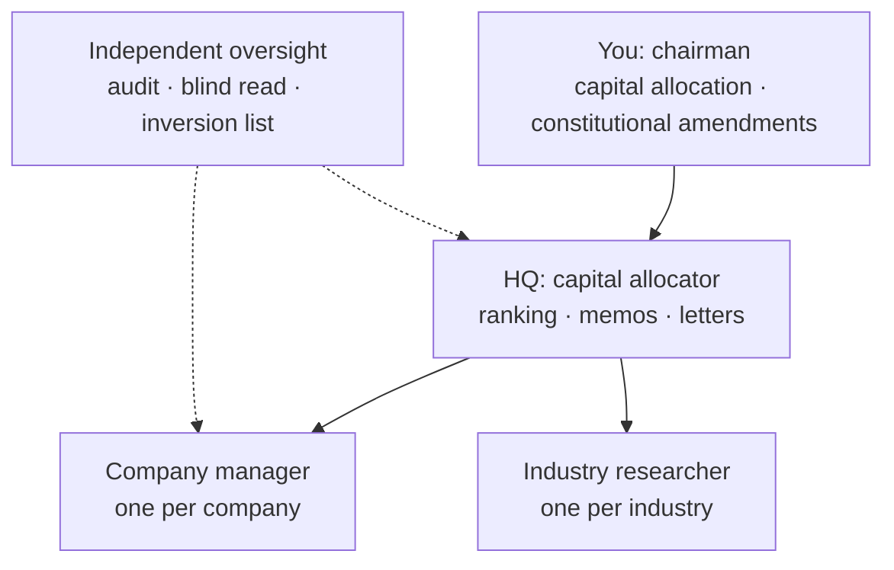
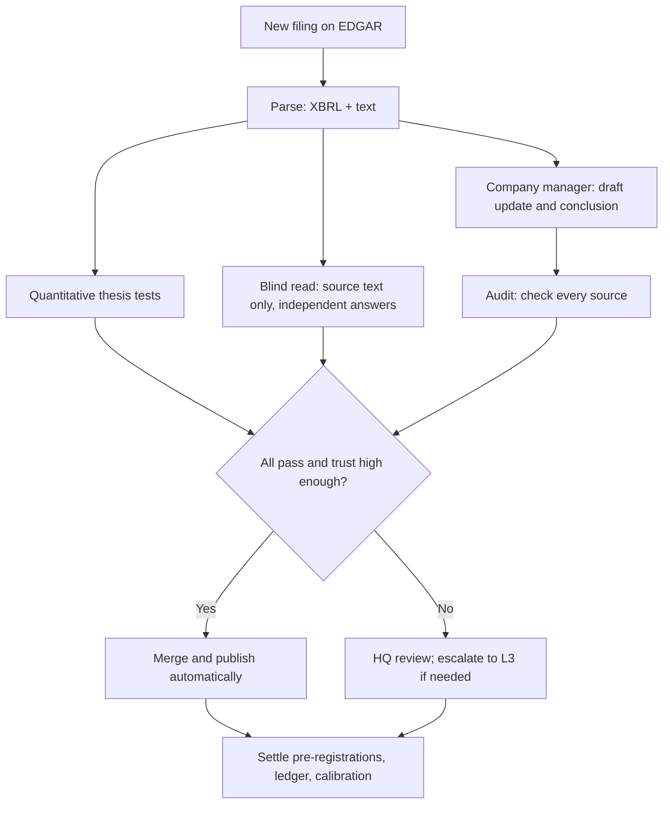

# Owner's Office: Project Framework and Approach

Sep 24, 2026 · @Ken

A Chinese version is in [zh-CN/docs/DESIGN.md](../zh-CN/docs/DESIGN.md).

## Positioning and differentiation

Owner's Office does not compete with existing projects on "who researches companies better". It adds the one thing none of them does: it keeps measuring whether your judgment as an owner is reliable. Others track only the companies; it tracks you as well.

| Direction | Representative projects | Question answered | Relation to this project |
| --- | --- | --- | --- |
| Trading multi-agent systems | [ai-hedge-fund](https://github.com/virattt/ai-hedge-fund/tree/main), [TradingAgents](https://github.com/tauricresearch/tradingagents) | Should I buy or sell now? | Not done here: no trading signals, no backtests |
| Research report generation | [FinRobot](https://github.com/ai4finance-foundation/finrobot) | What is this company worth? | Already covered by your 02 reports; not a selling point |
| Data and research platforms | [OpenBB](https://github.com/orgs/OpenBB-finance/repositories) | Where is the data, and how do I read it? | Only a candidate data source |
| Thesis monitoring | [Helm, MyThesis](https://helmterminal.dev/blog/thesis-tracking-apps), [ThesisLoop](https://thesisloop.ai/), [Mira](https://github.com/topics/decision-log) | Does the company still fit my thesis? | The closest neighbor; monitoring by itself is not an innovation |
| Master investors' methods + multi-agent | [ai-berkshire](https://github.com/topics/investment-research) | What would the masters think? | The look-alike direction we most need to avoid |
| Forecast calibration | [Fatebook](https://forum.effectivealtruism.org/posts/DWFRBzK3rAH3HFDZr/fatebook-the-fastest-way-to-make-and-track-predictions) | Are my probability judgments accurate? | We borrow its scoring method, but it knows nothing about financial reports |

All of these projects evaluate companies or trades; none of them systematically evaluates the investor. Thesis-monitoring tools even carry a built-in anchor: they read new evidence through your thesis, so the AI and you are led by the same conclusion.

This project bets on five things, each developed below:

1. **Berkshire-style decentralization.** The system runs autonomously under your investment constitution; you only allocate capital and amend the constitution. Each agent earns its authority through its track record of accuracy.
2. **Two-way accountability.** Management's promises to shareholders, and the system's and your forecasts, are settled in the same kind of ledger under the same rules.
3. **Verifiable pre-registration.** Pre-earnings expectations must be merged before the results are first made public, with a timestamp anyone can check.
4. **Anti-anchoring.** A "blind reader" model that cannot see the thesis reaches its own conclusions; where it diverges from the drafting model is where review time is best spent.
5. **Circle of competence, measured.** Calibration scores by domain turn Munger's "circle of competence" from a self-assessment into data.

To be honest, every individual part has precedents. Brier scoring is a standard tool of superforecasting research, and some have already argued that investors should score their sub-forecasts ([source](https://evakeiffenheim.substack.com/p/how-to-engineer-skill-in-investing)); ThesisLoop already advertises scoring of whether management delivers on its promises. What is new is wiring these parts into one archive and one earnings timeline. The great investors' philosophy serves here as an organizing principle, not as a stock-picking persona: there is no "Buffett agent" in the system, only an office run the Berkshire way. External descriptions draw the same line and do not use "master investors' methods" or "multi-agent debate" as selling points; both labels are already taken.

## Design principles

Seven principles. Compared with the previous version, the core change is decentralization: the system runs autonomously within your investment constitution, and you do only two things: allocate capital and amend the constitution.

1. **The owner's view.** What we track is the business thesis, not trades. The system produces no buy or sell signals, runs no backtests and makes no stock price predictions.
2. **Decentralized autonomy; escalate the exceptions.** Day-to-day decisions are made and carried out by the agents on their own under the investment constitution; only matters involving money or amendments to the constitution are escalated to you.
3. **Default to inaction.** For any matter involving money, the default option is always the status quo; if you don't reply, the default applies. The system will not and cannot trade for you.
4. **Price silence.** No daily stock prices are shown. Price appears only as an event: one alert when it enters or leaves a pre-written fair range or cheap range.
5. **Write it down first, verify later.** Expectations, probabilities and resolution criteria are registered before the results are known; afterwards they are settled against the criteria set in advance, judging the decision process rather than the outcome.
6. **Every number is traceable.** Every fact in the archive carries its source (which document, which section, which date); a number without a source cannot be merged.
7. **Independence, and trust is earned.** Drafting, audit and blind read cannot see each other's conclusions; each agent's autonomy grows or shrinks with its track record of accuracy.

## Core architecture: thesis as code

Each company's thesis is maintained like a software project: the archive is the source code, the thesis breakers are the tests, new filings trigger the tests, and merging a PR is a recorded decision.

| Software engineering | In Owner's Office | What it solves |
| --- | --- | --- |
| Source code | Company archive: 12-dimension framework, Markdown + YAML | Understanding has one authoritative version |
| diff | One commit per update, showing thesis changes line by line | You can see how understanding evolves |
| Unit tests | Thesis tests, rewritten from the thesis breakers | "What would prove me wrong" becomes an executable check |
| CI | Each new 10-Q, 10-K or 8-K automatically triggers all tests | Checks don't depend on memory or mood |
| Code review | Independent audit + the conclusion you write yourself | Guards against self-confirmation |
| Dependencies | Company archives reference industry research modules | Industry changes automatically reach the affected companies |
| Release | An annual "letter to the owner" written to yourself + the mistakes list | Review on a fixed rhythm |

**Three kinds of thesis tests.** Every test has its threshold written down before the results are known, and there are four possible results: pass, warn, fail, undetermined.

1. **Quantitative tests:** computed directly from XBRL financial data. Example: fail if diluted shares rise two years in a row; this tests buyback discipline.
2. **Qualitative tests:** judged by an independent model against the filing text, with a source and a quote of at most one sentence. Example: did management lower its medium-term financial targets?
3. **Staleness tests:** every fact in the archive carries an as-of date, and an alert fires when it goes stale without review. Example: the moat section has not been reviewed for more than four quarters.

**A failed test is not a sale.** After a failure, the agent responsible for the company must write a conclusion under the constitution within 7 days: hold, revise the thesis, or recommend trimming the position, with reasons. Only when the conclusion touches a sell condition in the constitution is it escalated to you as a memo: the moat is permanently impaired, the business model has fundamentally changed, management has deteriorated, capital allocation has gone seriously wrong, or a clearly better opportunity has appeared. The memo's default option is still the status quo.

**The PR is the decision record.** Every update PR has a fixed body structure: AI summary, evidence and sources, test results, audit opinion, blind-read divergences, and "Does this change the thesis?", written by the company agent citing constitution clauses. It merges automatically when all checks pass and the agent's trust level is high enough; otherwise it is escalated under the decentralization rules. GitHub's servers record the merge time; pre-registrations also get an OpenTimestamps timestamp.

**Reproducible.** Every AI output records the model name, the prompt version (git hash) and the input file hashes. When a conclusion changes, you can tell whether the world changed or the prompt did.

## Decentralized governance: Berkshire-style decision rights

The whole system is organized the Berkshire way: a tiny headquarters, autonomous companies, and a chairman who handles only capital allocation and picking people. You are the chairman; Claude Code and the agents are the managers. Buffett wrote in the Owner's Manual that Berkshire delegates almost to the point of abdication: of about 377,000 employees, only 26 work at headquarters, and he and Munger mainly allocate capital and look after key managers ([Owner's Manual](https://www.berkshirehathaway.com/ownman.pdf)).

**Three decision levels:**

| Level | Who decides | Matters | What you see |
| --- | --- | --- | --- |
| L1 autonomous | The agent decides and executes on its own | Fetching, parsing, drafting, testing, auditing, merging routine updates, correcting facts in the archive, checking industry signposts | No interruptions; summarized in the monthly letter |
| L2 act and report | The agent decides and executes, and reports afterwards | Pre-registration content, scenario probability changes, handling test warnings, rotating the candidate list, choosing models, public releases (the audit must be clean) | One line each in the monthly letter |
| L3 chairman | You decide; the system provides a one-page memo and a default option | Buying, adding, trimming, selling; amending the investment constitution | A one-page memo; no reply within 14 days means the default applies, that is, the status quo |

**Organization:**



A company manager is like the CEO of a Berkshire subsidiary: it is responsible for its company's archive, pre-registrations, tests and ledger, and hands its conclusions to HQ. HQ only compares across companies and makes capital allocation recommendations; independent oversight reports to no manager.

**Constitution highlights** (the rules the system governs itself by; Claude Code expands them into `constitution/owner.md`):

1. Business quality first, management second, valuation third; better a fair price for an excellent business than a cheap price for an ordinary one.
2. The touchstone of quality: if the stock market closed for ten years, would you still want to own it? Look at the moat, pricing power, capital returns and growing free cash flow.
3. Judge management by whether it allocates capital rationally, whether it thinks like an owner, and whether buybacks, dividends and reinvestment are handled sensibly.
4. Concentrate in 4–5 holdings; 10–20% is an entry bar, not a target; position size comes from depth of understanding, quality, certainty and margin of safety, not from volatility models.
5. DCF is only an approximation and a support; the discount rate equals the long-term risk-free rate plus a business-specific risk premium, the higher the quality the lower the premium, and 6–10% is only a reference under current rates.
6. Sell only for permanent deterioration or a clearly better opportunity; don't sell because of a price decline, a recession, panic or a single quarter below expectations.
7. Every holding's long-term expectation must beat VOO or Berkshire; cash is an option, and we don't buy to fill a position size or to put idle cash to work.
8. Trade rarely, build a position in one order, don't chase the perfect entry point.

**How the masters' principles become system rules:**

| Source | Principle | Becomes in the system |
| --- | --- | --- |
| [Buffett](https://www.berkshirehathaway.com/ownman.pdf) | Delegate almost to the point of abdication; headquarters handles only capital allocation and picking people | Three decision levels, and you handle only L3; "picking people" corresponds to HQ choosing a model for each role by error rate and cost |
| [Buffett](https://rationalwalk.com/highlights-from-warren-buffetts-letter-to-shareholders/) | Better to bear the visible cost of a few bad decisions than the invisible cost of bureaucratic delay | No manual approval for routine matters; errors are corrected by after-the-fact audits and downgrades |
| [Buffett](https://www.berkshirehathaway.com/ownman.pdf) | Candor: tell shareholders the facts you would want to know if your positions were reversed | The monthly letter leads with the bad news and "this month's biggest uncertainty" |
| [Munger](https://jamesclear.com/great-speeches/2007-usc-law-school-commencement-address-by-charlie-munger) | The highest form is a seamless web of deserved trust: little procedure, and trust that is deserved | Agent authority rises and falls with its accuracy record; a single factual error means a downgrade |
| Munger | Invert; stay within your circle of competence | Every update comes with an inversion list, "how could we lose money permanently?"; domains with poor calibration don't make the 10–20% candidates |
| [Lynch](https://invest-like.com/investors/peter-lynch/) | Companies fall into six categories; explain why you own one in two minutes | Monitoring templates are applied automatically by category and switched when the category changes; each company keeps a two-minute story, and that is the only part you read |
| [Druckenmiller](https://actionablenews.substack.com/p/aia-october-2024) | Look at the world 18–24 months out, not at today | Pre-registration uses 18 months as the main horizon, plus short-term items testable this quarter |
| [Kahneman](https://behavioralscientist.org/a-conversation-with-daniel-kahneman-about-noise/) | Judge component by component, independently and on facts, and delay the overall intuition | Audit and blind read cannot see each other; HQ looks at the component scores before reaching an overall conclusion |

**Earned trust:**

- Each company manager has a trust level of 0–3, set by the number of audit errors in its last 8 updates and by the after-the-fact rulings on divergences.
- Level 3: updates that pass all checks are merged and published automatically. Level 2: merged automatically, reviewed by HQ before publication. Level 1: updates stay in the private repository first and HQ reviews them item by item. Level 0: autonomy is suspended, and this goes into the "For your attention" section of the letter.
- One factual error drops a level; 4 consecutive error-free updates raise it one level; new agents start at level 1.

**What you still do:** read one letter a month, about 10 minutes; read one annual letter a year and decide whether to amend the constitution; the target is no more than 2 L3 memos a month. Everything else is left to the system.

**The cost of doing it this way:** Buffett himself admits that letting go means problems with managers are sometimes found a step late ([2009 shareholder letter](https://rationalwalk.com/highlights-from-warren-buffetts-letter-to-shareholders/)). This system compensates with three things: hard tripwires, independent audits and trust that is downgraded automatically.

## Four innovation modules

The four modules share one thread: hold yourself to the same standards you hold companies to, and write those standards down before the results are known.

### A. Pre-earnings pre-registration

Before results are released, each holding registers 3–5 settleable expectations, which are later settled against the criteria written in advance. The practice borrows from clinical trials and from registered reports in science: register the hypothesis first, then look at the data, so no hypothesis can be made up after the fact.

- **Who writes it:** the company manager agent drafts all expectations, with 18 months as the main horizon plus short-term items testable this quarter. Before the release you may change a probability or add an item, or do nothing; every change you make is recorded separately and called an "override".
- **Each expectation contains:** a statement, a probability, a resolution criterion and a data source. Example: "This quarter's year-over-year revenue growth is no lower than last quarter's; probability 60%; resolved by the 10-Q income statement."
- **Timing rule:** it must be merged before the results are first made public. The system checks against the `acceptanceDateTime` of the earnings release on EDGAR (Item 2.02 of the 8-K; a 6-K for foreign issuers such as PDD). The press release may come out before the filing, so the deadline is set at the end of the day before the release date. An OpenTimestamps timestamp is added at merge, so anyone can independently check that nothing was backdated.
- **Settlement:** once the report is filed, the AI settles each item against its criterion and cites the source; ambiguous cases are ruled on by HQ, and those still disputed are recorded as "undetermined" and not scored.

### B. Two-way say-do ledger

One kind of ledger keeps two books: what management has told shareholders, and what you have told yourself.

- **Management's side:** testable promises are extracted from shareholder letters, the MD&A in the 10-K, earnings press releases and investor-day materials: numeric targets, capital expenditure plans, buyback authorizations, product timelines. Each records its source and due date.
- **Four settlement grades:** kept, partially kept, not kept, silently dropped. "Silently dropped" means later communications never mention it again, which often says more than openly admitting a promise was not kept.
- **Candor:** does the next shareholder letter volunteer that a promise was not kept? This is Buffett's old way of judging management, and now it can be counted year by year.
- **Capital allocation scorecard:** the average price of each buyback is compared with the intrinsic value range in your archive at the time of the buyback, to see whether buybacks create value or burn cash at high prices. It accumulates from the day the archive is created.
- **The system's and your side:** pre-registered expectations, the three-year judgments in the 08 scenario document and the "expected outcome" in the decision log all go into the same ledger and are settled with the same four grades.

Scoring management alone is something products like ThesisLoop already do; what is new here is the symmetry.

### C. Calibration and a measured circle of competence

All settled expectations are aggregated by domain into calibration scores, so the boundary of the circle of competence is drawn by the record rather than by feel.

```latex
BS = \frac{1}{N}\sum_{i=1}^{N}(p_i - o_i)^2
```

Here p is the probability you gave and o is the outcome (1 if it happened, 0 if not). A score of 0 is perfect; reporting 50% on every item scores 0.25.

- **Grouped by domain:** enterprise software, payments and financial data, consumer goods, semiconductors, e-commerce and so on. Each group gets a Brier score and a calibration curve, that is, "of the things you called 70%, how many actually happened".
- **Two books:** one records the system's own forecasts, the other only your overrides. If your overrides are consistently more accurate than the system in a domain, you add real value there; if not, you should interfere less there. This is how the circle of competence gets measured, and it costs you almost no time.
- **How to use it:** as one piece of evidence for position sizing, not as a formula. Domains with poor calibration don't make the candidates for a 10–20% position, which is exactly your principle that "position size comes from depth of understanding".
- **An honest limitation:** the sample has to be large enough. With 4 holdings and 4 items per company per quarter, there will be about 80 system forecasts by the end of 2027; split across domains that is still thin, and your overrides will be fewer still. Until then, look only at trends and draw no conclusions.

### D. Industry–company dependency graph

The industry research in the Business Library becomes citable modules; each company archive declares which industries it depends on, and when an industry changes, the affected companies automatically enter review.

- **Example:** AXP depends on "payments and card networks", PEP and KO on "non-alcoholic ready-to-drink beverages", INTC and NVDA on "semiconductor foundry"; these are exactly the three industries you have already completed.
- **Signposts:** industry modules record observable signposts, for example the usage of some account-to-account real-time payment system or of stablecoins crossing a threshold set in advance. When a signpost triggers, CI opens a review issue for every company that depends on it and reruns the relevant thesis tests.
- **Your rule is kept:** industry modules themselves never discuss holdings or give recommendations; dependencies are written only on the company side.
- **Scope:** the first version covers only industry-to-company links; customer, supplier and competitor relationships between companies come in later phases. An industry judgment whose signposts can't be written down clearly cannot be monitored automatically.

## Repository structure and open-source strategy

Each of the three repositories has its own job: thesis-ci is an open-source tool anyone can install, owners-office is the public record you maintain with it, and the private repository holds the full archives and the amounts. Development is public from day one, and the updates themselves are the project's running record on GitHub.

| Repository | Visibility | Contents | License |
| --- | --- | --- | --- |
| thesis-ci | public | YAML format spec; GitHub Action for EDGAR monitoring and settlement; pre-registration verification (including OpenTimestamps); Brier and calibration tools | Code MIT, spec CC BY 4.0 |
| owners-office | public | Investment constitution and the masters' principles, decision-rights configuration, agent definitions, each company's thesis.yml, pre-registrations, forecasts and overrides, say-do ledgers, letters to the owner; a complete MSFT sample archive | Method documents CC BY 4.0, research content all rights reserved |
| owners-office-private | private | Full archives of the other companies, PDF reports, the decision log with amounts, scenario content for the valuation configurator | Not public |

```text
owners-office/
├── CLAUDE.md                  # standing rules, at most 200 lines
├── docs/
│   ├── DESIGN.md              # this document
│   ├── STATUS.md              # progress; a new session reads it to pick up the work
│   └── decisions/             # records of autonomous decisions
├── constitution/
│   ├── owner.md               # your investment constitution
│   ├── masters.md             # masters' principles → system rules
│   └── decision-rights.yml    # three decision levels and trust levels
├── agents/                    # each role's prompts, permissions and model
├── industries/                # industry modules and signposts
├── companies/
│   └── MSFT/                  # one directory per company; MSFT also has the full archive
│       ├── thesis.yml
│       ├── story.md           # the two-minute case for holding it
│       ├── prereg/
│       ├── ledger.yml
│       └── updates/
├── forecasts/                 # system forecasts + your override record
├── letters/                   # monthly and annual letters to the owner
└── .github/workflows/         # scheduled jobs, automerge, escalation
```

`thesis.yml` is the core file; both people and machines read it:

```yaml
company: AXP
category: stalwart         # Lynch category; sets the default monitoring template
depends_on: [industries/payments-card-networks]
trust_level: 1             # 0–3, adjusted automatically with the accuracy record
value_ranges:              # from the 02 report; price alerts only when a range is crossed
  fair: [null, null]
  cheap: [null, null]
tests:
  - id: AXP-Q1
    type: quantitative
    claim: Diluted shares keep falling; buybacks are really shrinking the share count
    metric: diluted_shares_yoy
    fail_if: "> 0 for 2 years in a row"
  - id: AXP-L1
    type: qualitative
    claim: Management has not lowered its published medium-term financial targets
    judge: independent_model
    evidence: required
  - id: AXP-S1
    type: staleness
    section: moat
    max_age_quarters: 4
```

- **Source convention:** numbers in the archive are marked with source tags; in `sources.yml` each tag maps to an EDGAR accession number, a section and a date. Anything that fails the lint check cannot be merged.
- **Decision log:** keeps your existing nine fields (date, decision, company, original thesis, assumptions, expected outcome, risks, review date, outcome). Once you decide on an L3 memo, the system drafts the log entry automatically and links the PR; after you execute at your broker, you only need to reply "executed".
- **Segment data:** segment metrics such as Azure growth are often not in EDGAR's standard companyfacts data; the filing text has to be parsed, with a model extracting the figures and citing the source.
- **Versioning:** thesis-ci is labeled v0.x at first and becomes v1.0 after two earnings seasons. The blind-read divergence check will be split out as a separate open-source tool once enough data has accumulated to show that it works.

## The pipeline for one earnings event

From a new filing appearing on EDGAR to the merge, the whole pipeline needs nothing from you by default: the company manager drafts, the audit and the blind read check independently, and when all checks pass and the trust level is high enough, the update is merged and published automatically. The target is to finish within 24 hours after a new filing arrives.



The pipeline is triggered by GitHub Actions polling EDGAR's submissions API on a schedule, following the SEC's fair access rules: limit the request rate and state contact details in the User-Agent ([API notes](https://fundamentalshub.com/blog/data-sec-gov-submissions-json)).

| Role | Can see | Cannot see | Produces |
| --- | --- | --- | --- |
| Company manager | Archive, constitution, new filings | No restrictions | Update draft, a conclusion citing the constitution, next quarter's pre-registration |
| Audit | Every fact in the draft + the matching source excerpt | The reasoning and conclusions in the archive | Item-by-item marks: accurate, wrong, no source |
| Blind read | New filing text + the thesis question list | Archive, draft, any conclusion | An independent answer to each thesis question |
| HQ | All companies' theses, scores, value ranges | No restrictions | Ranking against the 10–20% entry bar, L3 memos, the monthly letter |

**The divergence map goes to HQ first, not to you.** The system compares the company manager's conclusions with the blind read's answers question by question and marks each as agree, diverge or cannot tell. HQ spends its review time on the divergences first; only divergences that are still unresolved after review and touch the thesis go into the "For your attention" section of the letter.

**All 13 prompts go on the schedule instead of waiting for you to start them.** 03 is the company manager's quarterly update, 04 is the audit, 05 is a round of automatic revision before the PR is opened. After each annual report is filed, 06–08 automatically refresh the deep understanding, then 11 synthesizes the complete report; 09, 10, 12 and 13 are the corresponding audits and revisions. 01 (building the archive) and 02 (the research report) run automatically when a candidate company joins the list.

**Robustness requirements:**

- When any step fails, open an issue explaining why; never skip silently. If the same step fails twice in a row, it goes into the letter.
- The blind read runs only for holdings; candidate companies get only the quantitative tests and the company manager's draft, to control cost.
- All model calls go through one module, which records the model name, prompt version and input hash in one place.
- The target is no more than 2 L3 memos a month; when it is exceeded, HQ must explain why in the letter and raise the escalation threshold.

## Public face: the valuation configurator

The valuation configurator is the public face of owners-office: users configure judgments about the business, not numbers. It is scheduled for Phase 5 and will only be built after the system has accumulated scenario and calibration data.

**Why no free sliders.** Based on next year's cash flow, the terminal multiple is about 1/(r−g). Lowering the discount rate from 8% to 7% and raising perpetual growth from 3% to 3.5% moves the multiple from 20x to about 28.6x and raises terminal value by 43%. Free sliders let users keep adjusting until the price "looks reasonable", and calculators like that are already common. Buffett also says intrinsic value is an estimate, not a precise figure, and two people looking at the same set of facts will arrive at different figures ([Owner's Manual](https://www.berkshirehathaway.com/ownman.pdf)).

**How it works:**

- **The discount rate comes from judgments:** users answer whether the moat is widening or narrowing, how predictable the cash flows are, and which cell of the Munger matrix management falls into; from these the system sets a risk premium and adds the automatically updated long-term risk-free rate. It follows the constitution's rule "the higher the quality, the lower the premium" exactly, and the mapping table is written in the public constitution.
- **Growth comes from scenario cards:** the cards are taken from the 08 scenario document, each with evidence, a probability and the system's calibration record on judgments of that kind.
- **The output is a range:** a value range, plus a panel "what the current price assumes", that is, a reverse DCF.
- **Animation carries meaning:** for example, "the share of value beyond year ten" grows and shrinks with the user's choices, so people can see how much the valuation depends on the distant future.
- **Limits:** only selected companies from the archives, starting with a single MSFT page; the page shows "what these assumptions imply", not buy or sell advice. The front end and the scenario content are closed source, as a future subscription product.

## Phased roadmap and acceptance criteria

Six phases, paced by the earnings seasons. An acceptance script decides whether a phase is complete: when it passes, Claude Code moves to the next phase automatically, without your sign-off; only a failure goes into the letter.

| Phase | Timing | Deliverables | Automatic acceptance |
| --- | --- | --- | --- |
| 0 Skeleton, constitution and migration | End of September to mid-October, before the first holding reports results | Three repositories; CLAUDE.md; schema and lint; constitution/; thesis.yml and two-minute stories for the 4 holdings | lint passes completely; at least 5 thesis tests per company; every constitution rule maps to an executable check |
| 1 Run one season semi-automatically | Mid-October to end of November 2026 (Q3 earnings season) | Claude Code triggers the pipeline step by step; the system writes pre-registrations; the first monthly letter | All pre-registrations merged and timestamped before the release; an update merged within 7 days after each report is filed |
| 2 Automation | November 2026 to January 2027 | EDGAR monitoring, automatic PRs, automerge rules, trust levels | Replay the Q3 reports and compare the automatic results with the Phase 1 conclusions item by item, with every difference explained; a PR within 24 hours of a new filing |
| 3 Isolation, ledgers and HQ | January–February 2027 (Q4 earnings season) | Audit and blind read, divergence map, say-do ledger, capital allocator, L3 memos | Every PR carries an audit opinion and a divergence map; no more than 2 L3 memos a month |
| 4 Calibration and open source | From spring 2027 | thesis-ci v1.0, calibration dashboard, industry dependency graph, Chinese and English README | Calibration updated automatically after every settlement; a review issue opened automatically when an industry signpost changes |
| 5 Valuation configurator | From the second half of 2027 | A single-page MSFT configurator, then selected companies added step by step | Every scenario card has evidence and a calibration record; no buy or sell advice on the page |

**Success criteria:**

- **Continuity:** for 4 consecutive earnings seasons, every holding is pre-registered on time and has its updates merged on time. This is the project's only hard measure of being "alive".
- **Quality:** unsourced numbers in merged content stay at 0; the audit error rate falls quarter by quarter and trust levels rise overall.
- **Your time:** about 15 minutes a month: read one letter and handle 0–2 memos.
- **Learning:** about 80 settled system forecasts by the end of 2027, the first calibration table by domain, compared with your override record.

## Risks, boundaries and non-goals

With decentralization, the biggest risk shifts from "you think too little" to "problems are found too late". The countermeasure is to replace your attention with hard rules: tripwires, independent audits and trust that is downgraded automatically.

| Risk | What it looks like | Countermeasure |
| --- | --- | --- |
| Found too late | After letting go, problems take a while to surface; Buffett admits this is the price of decentralization | Hard tripwires, independent audits, automatic trust downgrades; the letter must lead with the bad news |
| Gaming the rules | Agents learn to please the checks instead of pursuing accuracy | Each month HQ picks one merged update at random for an independent model to review from scratch; the result counts toward the trust level |
| The model misreads numbers | The draft cites wrong data | Numbers that can be matched to XBRL are checked automatically; the rest must carry sources and are checked item by item by the audit |
| Publicity amplifies the inconsistency-avoidance tendency | The more public, the less willing to admit mistakes | A separate `mistakes.md`; "thesis change" is a PR label counted publicly, and changing your mind counts as an achievement, not a stain |
| Complexity out of control | Automation is half done and the quarterly updates break | Acceptance scripts gate the phases; if the pipeline breaks, fall back to the Phase 1 semi-automatic process, and updates must not stop |
| Privacy | Amounts or account information leak | Amounts are stored only in the private repository; API keys go only into GitHub Secrets, never into code |
| Copyright and trademarks | The public repository stores third-party full texts or company logos | Store only structured excerpts, links and quotes of at most one sentence; logos stay only in private reports |
| Compliance | Public content is taken as investment advice; charging fees in the future | The README states that it is not investment advice; before charging, find out what Ontario securities regulation requires of paid research |

**Non-goals:**

- **No trading signals, backtests or stock price predictions.** That is the territory of trading projects, and it goes against the owner's view.
- **No general research platform or data terminal.** Projects like OpenBB already do this well; this project only consumes data.
- **No automated trading.** Money matters always stop at L3, and you execute them yourself at your broker.
- **No pursuit of coverage.** The pipeline handles only the holdings and the three candidates chosen by HQ; the other archives are refreshed automatically once a year with the annual report.

## Kickoff instructions for Claude Code

You only need to do three one-time things; after that, Claude Code proceeds on its own according to this document. The questions that used to need your decision now have defaults set according to your constitution, and you can overturn them at any time.

**Defaults already set for you:**

| Decision | Default | Basis |
| --- | --- | --- |
| What is public | The constitution, the method and the forecast record are all public; of the full archives, only MSFT's is public, the rest are private | Research reports are a future subscription product; one complete sample is enough to prove quality |
| Repository language | Documents mainly in Chinese; the README bilingual in Chinese and English | Your research language is Chinese; the open-source audience needs an English entry point |
| Model assignment | A mid-tier model for drafting, the strongest model for audit and blind read | The audit is the last line of defense against errors and deserves the best |
| Model budget | A cap of $20 a month; near the cap, pause candidate companies first, then downgrade the drafting model | Start small and adjust to actual usage |
| Candidate companies | HQ takes the top three in its ranking against the 10–20% entry bar, rotated automatically each quarter | The opportunity cost principle: candidates must be compared with the existing holdings |
| Phase progression | Move to the next phase automatically once the acceptance script passes | Decentralization: hard checks instead of sign-offs |

**The three one-time tasks:**

1. Install Claude Code on your computer and log in with the GitHub command-line tool (`gh auth login`).
2. Put the existing archive PDFs and the 01–13 prompts into one folder; when you start, tell me and I will export this document as `DESIGN.md` into the same folder. Then start Claude Code in that folder and paste in the instructions below.
3. Once Claude Code has created the repositories, it will ask you to put the model API key into GitHub Secrets once. Only you can put the key there; never paste it into any chat.

After that, each time you open Claude Code, just say "keep going": it reads `docs/STATUS.md` and picks up where it left off. CLAUDE.md is loaded automatically in every session, and the shorter it is, the more reliably it is followed ([official docs](https://code.claude.com/docs/en/memory)); hard rules must be made into CI checks or hooks, not just written in CLAUDE.md.

**Kickoff instructions:**

```text
You are the chief engineer of Owner's Office. First read DESIGN.md in full, then proceed on your own until the Phase 0 acceptance script passes completely.

Scope of authority:
- You make every engineering decision within Phase 0: directories, schemas, scripts, tests, CI.
- Details the design document does not cover, decide yourself according to the principles in constitution/, and record them in docs/decisions/ with the options, the rationale and the rejected alternatives.
- Stop and ask me about only two kinds of things: operations involving money, and amendments to the investment constitution. Don't ask me about anything else.
- Record progress in docs/STATUS.md so that later sessions can pick up the work.

Hard rules (put them in CLAUDE.md and make them CI checks as far as possible):
- Every number in the archive must carry a source tag;
- Don't fetch or display daily stock prices; prices are used only for an alert when a value range is crossed;
- No buy or sell advice in public content; execute no trades;
- Value ranges and L3 memos are stored only in the private repository; the public thesis.yml contains no value_ranges;
- Model calls may live only in pipeline/llm.py, which records the model name, prompt version and input hash.

Phase 0 tasks:
1. Build the skeletons of the three repositories thesis-ci, owners-office (public) and owners-office-private (private), and put DESIGN.md into owners-office/docs/.
2. Organize the constitution highlights and the masters' principles from the design document into constitution/, marking each rule with the executable check it maps to.
3. Define JSON Schemas for thesis, prereg, ledger, forecast and decision-rights, write the lint and wire it into CI.
4. Using the archives in the folder, generate thesis.yml and a two-minute story for each of the 4 holdings: first apply the monitoring template by Lynch category, then add from the thesis breakers. Never make up numbers; where data is missing, leave it empty and record it as a to-do.
5. Once acceptance passes, write a Phase 0 letter to the owner (one page at most): what was done, which decisions were made, and the plan for the next phase.
```

**Sources checked:** [Claude Code memory docs](https://code.claude.com/docs/en/memory), [EDGAR submissions API notes](https://fundamentalshub.com/blog/data-sec-gov-submissions-json), [overview of thesis-tracking products](https://helmterminal.dev/blog/thesis-tracking-apps), [Berkshire Owner's Manual](https://www.berkshirehathaway.com/ownman.pdf), [excerpts from Buffett's 2009 shareholder letter](https://rationalwalk.com/highlights-from-warren-buffetts-letter-to-shareholders/).
